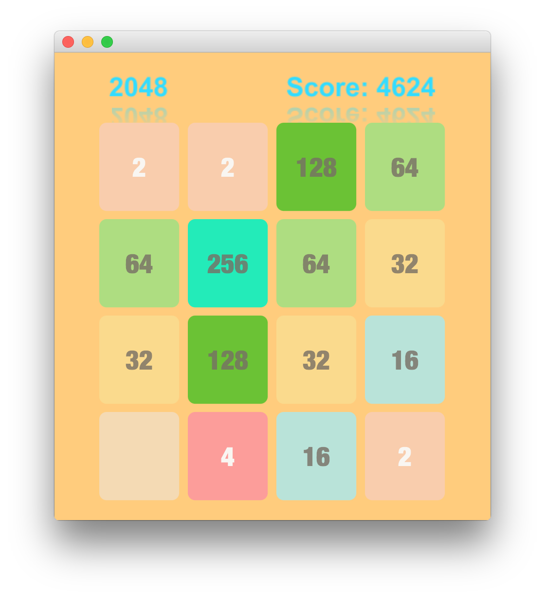
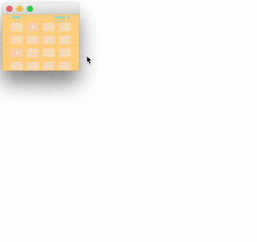
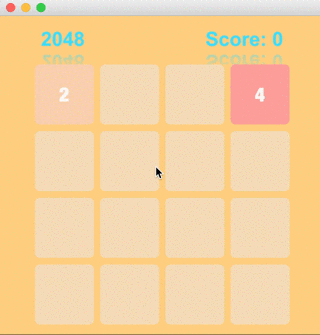

## 2048 Game

A Java/Javafx clone of the popular 2048 game with new features rotate and undo.

The Game logic flow is written in Java and GUI part is written in Javafx.

## Usage: 

1. Compile all the java files
    ***javac *.java***

2. 
  
  a) Play the 2048 Game with Graphical User Interface

    ***java Gui2048 [ -i|-o|-s file]***
    

  b) Play the 2048 Game with Command Line 

    ***java Game2048 [ -i|-o|-s file]***

    > **-i** [file]  -> Specifies a 2048 board that should be loaded
  
    > **-o** [file]  -> Specifies a file that should be used to save the 2048 

    > **-s** [size]  -> Specifies the size of the 2048 board. If an input file hasn't been specified and both -s and -i are used, then the default size of the board is 4.

3. Controls:
   
   ***For Command Line***
   
   > **w** - Move Up

   > **s** - Move Down
  
   > **a** - Move Left
   
   > **d** - Move Right
   
   > **q** - Quit and Save Board
   
   > **u** - Undo the Previous Move 
   
   > **r** - Rotate the Board Clockwise
   
   
   ***For GUI***
      
   > **Arrow Key Up** - Move Up

   > **Arrow Key Down** - Move Down
  
   > **Arrow Key Left** - Move Left
   
   > **Arrow Key Right** - Move Right
   
   > **q** - Quit and Save Board
   
   > **u** - Undo the Previous Move 
   
   > **r** - Rotate the Board Clockwise

## Screen Recording

**Rotate**

 

